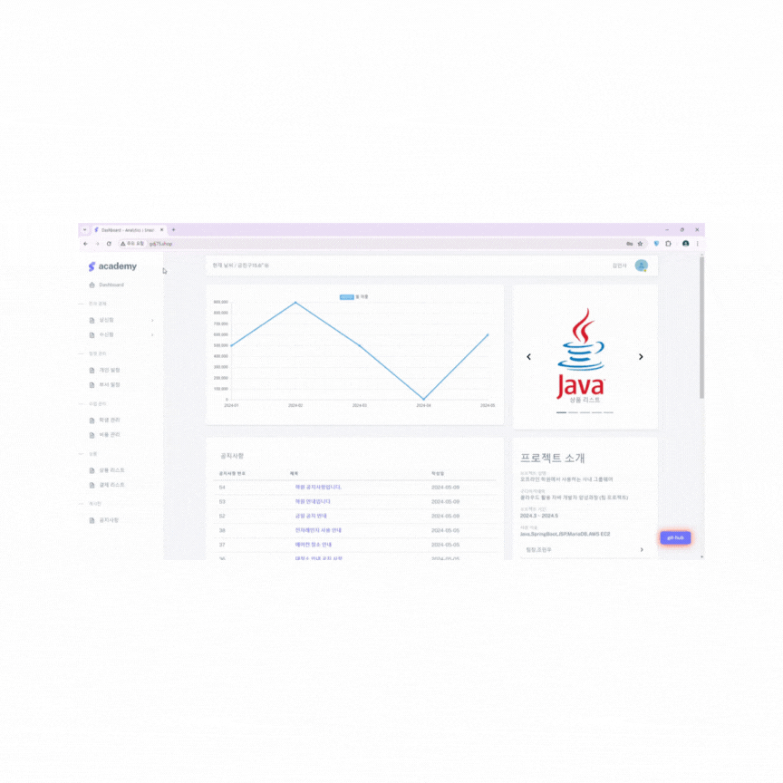

# AKA FINAL 
---

### 프로젝트 소개
+  오프라인 학원에서 사용하는 사내 그룹웨어 

### :school:구디아카데미
+  <https://www.gdu.co.kr/main/main.html>
+  클라우드 활용 자바 개발자 양성과정 (팀 프로젝트) 

### :clock2:프로젝트 기간
+  2024.3 ~ 2024.5

### :computer:개발 환경
+   JAVA  : JAVA 17
+   FRONT-END : HTML5 JavaScript JQuery JSP
+   BACK-END : Mybatis Spring Servlet
+   FRAME WORK : SpringBoot 4.21.1
+   DATA BASE : AWS Docker MariaDB
+   SERVER : Tomcat(v9.0)
+   OS : Windows10 MacOS
+   Document : Google Drive  KakaoOven ERDCloud
+   Libray&API : Spring Security Validation MailSender FileUpload
+   Lomnbok Full Calender KakaoLogin WebClient JsonSimple JsonJackson

---

### :two_men_holding_hands: 팀원소개
#### 팀장 조민우  
thezotico@gmail.com
+  1.전자 결재 시스템 구현

#### 팀원 김승균   
dirokim7@gmail.com
+  1.학원비 결제 시스템(tosspayment)
+  2.학생,비품,상품 관리
+  3.공지사항
+  4.메인페이지(기상청api데이터,chart.js)

#### 팀원 고민효   
gohyo7@gmail.com
+  1.스프링 시큐리티 구현
+  2.로그인,로그아웃,회원가입,마이페이지 구현
+  3.스케쥴 관리 구현(Full Calendar)

### : 배포
+  배포 도메인 주소   <http://gdj75.shop>
+  아이디 : hire1234 / 비밀번호 : 11

### : 구현
---
#### 메인페이지

